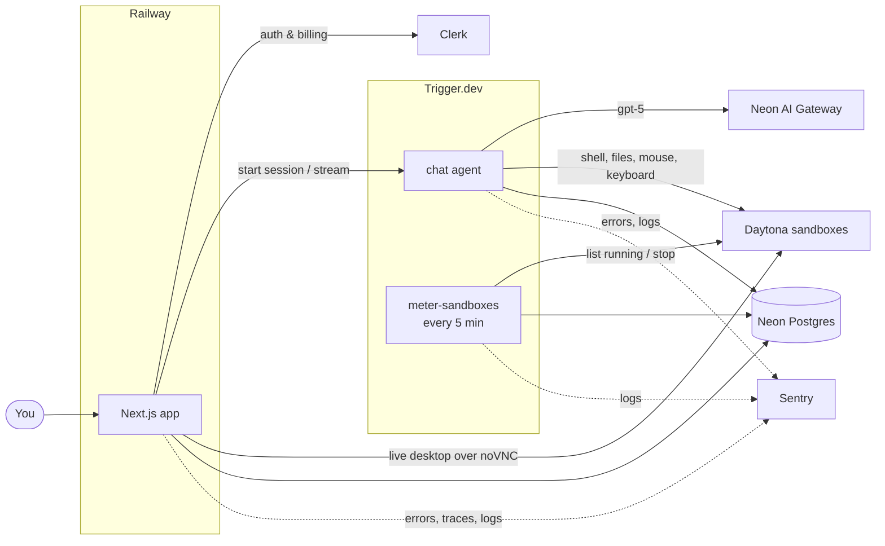

<div align="center">


# AI Teammates

### The open-source alternative to Grok Bot, OpenAI Dots and Meta Muse

AI teammates with a job, a memory and a cloud computer of their own.

[](https://www.youtube.com/watch?v=mQBuZ6Dp0u0)

[](https://cwa.run/trigger-1)
[](https://cwa.run/daytona)
[](https://cwa.run/firecrawl)
[](https://cwa.run/clerk)
[](https://cwa.run/sentry)
[](https://cwa.run/neon)
[](https://cwa.run/railway)

</div>

---

2026 is the year AI stopped being a chat box and became a coworker. Grok Bot, OpenAI Dots and Meta Muse all landed on the same idea: an always-on agent with a computer of its own that does the work instead of describing it. They are also closed.

AI Teammates is an open exploration of that idea. Every prompt, tool and limit is a file in this repository, with auth, billing, usage metering and observability already in place, so you start from a working product and change whatever you like.

## 🎬 Watch it being built

[](https://www.youtube.com/watch?v=mQBuZ6Dp0u0)

## ✨ Features

- 🧑‍💼 **Teammates with a job** — a name, a job and instructions that each bot keeps in every conversation.
- 🖥️ **A computer per teammate** — a persistent Linux sandbox with a shell, a filesystem and a graphical desktop.
- 👀 **Live desktop view** — watch a bot move the mouse and type, streamed into the chat.
- 👥 **Group chats with handoffs** — a bot passes a request to the teammate whose job it is.
- 🧠 **Memory across chats** — notes a bot saves in one conversation are there in all the others.
- ♾️ **Durable turns** — a long desktop task survives refreshes, redeploys and closed tabs.
- 💳 **Plans and usage limits** — subscriptions, with model spend and sandbox hours metered per billing period.

## 🧱 Built with

| Product                                      | What it does here                                                                             |
| -------------------------------------------- | --------------------------------------------------------------------------------------------- |
| [**Trigger.dev**](https://cwa.run/trigger-1) | Runs the durable chat agent and the cron task that meters running sandboxes.                  |
| [**Daytona**](https://cwa.run/daytona)       | One cloud sandbox per bot: shell, files and a desktop it controls.                            |
| [**Clerk**](https://cwa.run/clerk)           | Authentication, plus Billing for plans, checkout and feature gates.                           |
| [**Neon**](https://cwa.run/neon)             | Serverless Postgres, and the AI Gateway the chat model is called through.                     |
| [**Sentry**](https://cwa.run/sentry)         | Errors, traces, session replays and logs from the app and every task run.                     |
| [**Railway**](https://cwa.run/railway)       | Hosts the Next.js app in production.                                                          |
| [**Firecrawl**](https://cwa.run/firecrawl)   | Web search and scraping for the coding agent this project is developed with, through its CLI. |

Plus Next.js 16, React 19, AI SDK 7, shadcn/ui, Tailwind CSS 4, Drizzle ORM and DiceBear.

## 🔍 How it works



- **A chat turn** (`trigger/chat.ts`) builds the bot's instructions from its job and streams a reply with the sandbox tools attached (`lib/sandbox-tools.ts`). It stops after 50 steps or when the allowance is spent.
- **In a group chat** the bot also gets a `handoff` tool, which gives the rest of the turn to a teammate. A request cannot bounce back to a bot that already held it.
- **Usage** is an append-only ledger. Model spend is written when a turn completes; sandbox time by a task that charges every running sandbox each five minutes and stops those of owners who have run out. Limits live in `lib/usage.ts`.

## 🚀 Getting started

You need Node.js 20.12+ and an account with [Clerk](https://cwa.run/clerk), [Neon](https://cwa.run/neon), [Trigger.dev](https://cwa.run/trigger-1), [Daytona](https://cwa.run/daytona) and [Sentry](https://cwa.run/sentry).

**1. Clone and install**

```bash
git clone https://github.com/code-with-antonio/ai-teammates.git
cd ai-teammates
npm install
```

**2. Create `.env.local`**

```bash
# Clerk: API keys
NEXT_PUBLIC_CLERK_PUBLISHABLE_KEY=
CLERK_SECRET_KEY=
NEXT_PUBLIC_CLERK_SIGN_IN_URL=/sign-in
NEXT_PUBLIC_CLERK_SIGN_UP_URL=/sign-up
NEXT_PUBLIC_CLERK_SIGN_IN_FALLBACK_REDIRECT_URL=/
NEXT_PUBLIC_CLERK_SIGN_UP_FALLBACK_REDIRECT_URL=/

# Neon: pooled string for the app, direct string for drizzle-kit
DATABASE_URL=
DATABASE_URL_UNPOOLED=

# Neon AI Gateway
NEON_AI_GATEWAY_BASE_URL=
NEON_AI_GATEWAY_TOKEN=

# Trigger.dev: the development key
TRIGGER_SECRET_KEY=

# Daytona
DAYTONA_API_KEY=

# Sentry: optional, uploads source maps on build
SENTRY_AUTH_TOKEN=
```

**3. Point the code at your accounts**

| Replace                      | In                                                                                                 |
| ---------------------------- | -------------------------------------------------------------------------------------------------- |
| Trigger.dev project ref      | `trigger.config.ts`                                                                                |
| Sentry DSN                   | `sentry.server.config.ts`, `sentry.edge.config.ts`, `instrumentation-client.ts`, `trigger/init.ts` |
| Sentry org and project slugs | `next.config.ts`, `trigger.config.ts`                                                              |

**4. Set up billing** — in Clerk, enable Billing and create a user plan with two features, slugged `bots` and `sandboxes`.

**5. Push the schema and run**

```bash
npm run db:push            # create the tables
npm run dev                # terminal 1: Next.js
npx trigger.dev@4.7.3 dev  # terminal 2: Trigger.dev tasks
```

Open [http://localhost:3000](http://localhost:3000), sign up, pick a plan and create your first teammate.

## 🚢 Deployment

- **App** — create a [Railway](https://cwa.run/railway) service from the repository and add the variables from `.env.local`, with the **production** `TRIGGER_SECRET_KEY`.
- **Tasks** — run `npx trigger.dev@4.7.3 deploy`, and add `DATABASE_URL`, `CLERK_SECRET_KEY`, `DAYTONA_API_KEY`, `NEON_AI_GATEWAY_BASE_URL` and `NEON_AI_GATEWAY_TOKEN` to the project's production environment in Trigger.dev.

## 🤝 Contributing

Issues and pull requests are welcome. Run `npm run lint`, `npm run typecheck` and `npm run format` before opening one.

---

<div align="center">

Built by [Code With Antonio](https://github.com/code-with-antonio)

<sub>An independent project, not affiliated with or endorsed by xAI, OpenAI or Meta.</sub>

</div>
